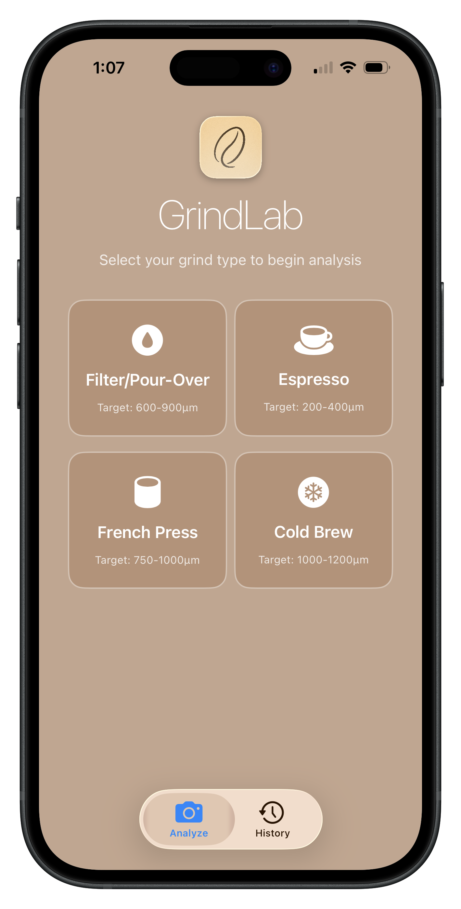
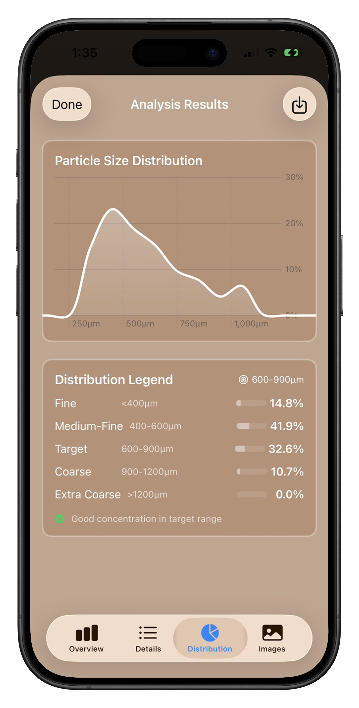

<div style="text-align: center;">
  
</div>
<br>

# GrindLab

GrindLab is an iOS/macOS application built with SwiftUI that analyzes coffee grind consistency using computer vision. The app uses the device camera to capture images of coffee grounds and provides detailed analysis including particle size distribution, uniformity metrics, and brewing recommendations.

## Why GrindLab?

Grind size has the largest impact on extraction quality, but measuring it consistently has always been a challenge. Most of us eyeball it or rely on grinder settings that can vary from day to day. GrindLab aims to change that by turning your iPhone's camera into a precise measurement tool, giving you the data you need to dial in the perfect cup.

<div style="text-align: center;">
  
  
</div>
<br>

## Key Features

### 📸 **Advanced Image Analysis**
- Real-time camera capture with Vision framework processing
- Particle detection and size distribution analysis
- Coin calibration for accurate physical measurements (μm scale)
- Support for multiple grind types: Filter, Espresso, French Press, Cold Brew

### 📊 **Detailed Metrics**
- Particle size distribution histograms
- Uniformity coefficient and statistical analysis
- Median, mean, and standard deviation calculations
- Fines and boulders percentage tracking

### ☕ **Brewing Recommendations**
- Grind type-specific target ranges:
  - **Filter/Pour-Over**: 400-800μm
  - **Espresso**: 170-300μm
  - **French Press**: 750-1000μm
  - **Cold Brew**: 800-1200μm
- Personalized adjustment suggestions based on analysis results
- Extraction quality indicators

### 📝 **Tasting Notes & History**
- Log flavor profiles alongside grind analysis
- Track brewing parameters and results over time
- Compare analyses to dial in consistency
- Export and share your data

## Getting Started

### Requirements
- iOS 15.0+ / macOS 12.0+
- Xcode 14.0+
- Swift 5.5+

### Installation

1. Clone the repository:
```bash
git clone https://github.com/yourusername/GrindLab.git
cd GrindLab
```

2. Open in Xcode:
```bash
open "Coffee Grind Analyzer.xcodeproj"
```

3. Build and run on your device or simulator

### Usage

1. **Select Grind Type**: Choose your brewing method to set appropriate target ranges
2. **Capture Image**: Place coffee grounds on a white background, optionally with a coin for calibration
3. **Analyze**: Let the Vision framework detect and measure particles
4. **Review Results**: View distribution graphs, uniformity metrics, and recommendations
5. **Log Notes**: Add tasting notes and brewing parameters for future reference

## Technical Architecture

### Core Technologies
- **SwiftUI**: Modern declarative UI framework
- **Vision Framework**: Apple's computer vision for particle detection
- **AVFoundation**: Camera capture and management
- **Core Image**: Advanced image preprocessing

### Project Structure
```
Coffee Grind Analyzer/
├── Analysis/          # Image processing and analysis engine
├── Camera/           # Camera capture and preview
├── Models/           # Data models and persistence
├── Views/            # SwiftUI views and components
└── Assets.xcassets/  # Icons and resources
```

## Contributing

We welcome contributions! Please feel free to submit pull requests or open issues for:
- Bug fixes
- New features
- Performance improvements
- Documentation updates

## License

This project is licensed under the MIT License - see the LICENSE file for details.

## Acknowledgments

- Coffee science community for grind size research
- Apple Vision framework documentation
- SwiftUI developer community

---

Built with ☕ and Swift by coffee enthusiasts, for coffee enthusiasts